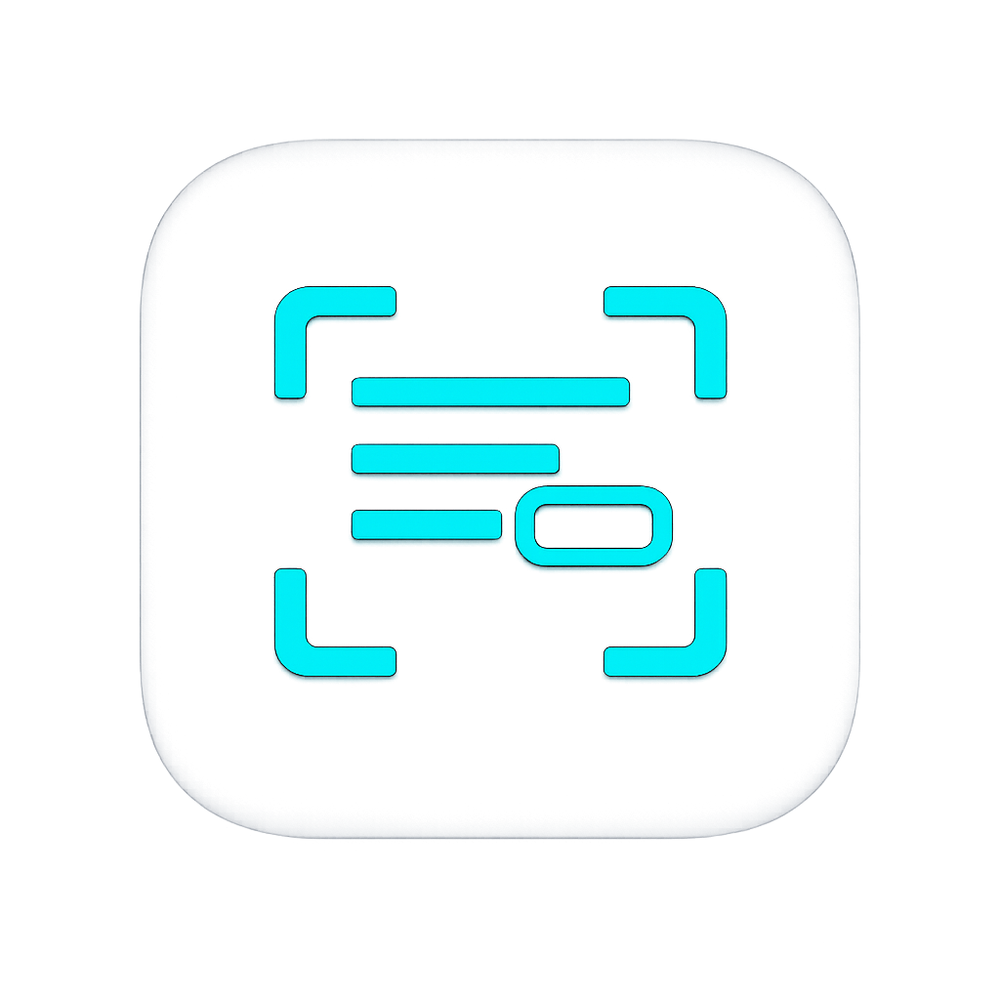

<div align="center">



# SnapText

**Copy text from any screen on your Android phone.**

Tap the Quick Settings tile over any app, and SnapText scans the screen with on‑device OCR, highlights every word, and lets you tap or drag to select and copy — like Google Lens, but as a system‑wide tile.

[](https://github.com/dilanmelvin/Snap-Text/releases/latest/download/SnapText.apk)

[](#requirements)
[](#tech-stack)
[](#tech-stack)
[](#license)

</div>

---

## 📥 Download & Install (Android)

**[⬇️ Tap here to download SnapText](https://github.com/dilanmelvin/Snap-Text/releases/latest/download/SnapText.apk)** — open this link on your Android phone.

Then:

1. Open the downloaded `SnapText.apk` (check your **Downloads** or the notification).
2. Android will ask to **allow installing apps from this source** — tap **Settings → Allow**, then go back and **Install**.
3. Open **SnapText**, grant the overlay permission, and add the Quick Settings tile (the app walks you through it).

> The download link always points to the **latest release**. If it 404s, no release has been published yet — see [Publishing a downloadable build](#-publishing-a-downloadable-build).

You can also install with a cable via ADB:

```powershell
adb install -r SnapText.apk
```

---

## ✨ What it does

- **Works over almost any app** — launched from a Quick Settings tile, not a separate screen.
- **On‑device OCR** — text is recognized locally; nothing is uploaded.
- **Multi‑language** — English, Chinese, Japanese, Korean, Hindi (Devanagari) and Latin‑based languages.
- **Freeze‑frame** — the screen is captured and frozen, so a playing video/reel looks paused while you work.
- **Clear highlights** — every detected word is boxed so you can see exactly what's selectable.
- **Tap or drag to select** — tap a single word, or drag across words and lines to grab a whole sentence/paragraph.
- **Select all** — grab everything on the screen in one tap.
- **Reliable copy** — copies to the clipboard on every device (even OEMs that block overlay clipboard writes).
- **Formatted output** — words on a line are joined with spaces; lines are separated with line breaks.
- **Private by design** — no account, no servers, no analytics, no ads.

---

## 🎯 How it works

1. Open any app that has text you want.
2. Pull down **Quick Settings** and tap **SnapText**.
3. Approve Android's screen‑capture prompt — the screen **freezes** and every word is highlighted.
4. **Tap** a word, or **drag** across words and lines.
5. Tap **Copy** — the text is on your clipboard, ready to paste anywhere.

---

## 📱 Requirements

| | |
|---|---|
| **Android** | 8.0 (API 26) or newer |
| **Permissions** | Display over other apps (overlay), Screen capture (asked each time by Android) |
| **Storage** | ~50 MB (language models are bundled for offline use) |

---

## 🔐 Permissions & why they're needed

| Permission | Purpose |
|---|---|
| `SYSTEM_ALERT_WINDOW` | Draw the selectable text overlay on top of other apps. |
| `FOREGROUND_SERVICE` | Run the one‑shot screen capture as a foreground service. |
| `FOREGROUND_SERVICE_MEDIA_PROJECTION` | Required for MediaProjection foreground services on modern Android. |

SnapText only captures a **single frame** when you trigger it, processes it **in memory**, and never stores or uploads screenshots.

---

## 🧠 Tech stack

- **Language:** Kotlin
- **UI:** Android XML layouts + ViewBinding, Material Components
- **Screen capture:** Android `MediaProjection` + `ImageReader` + `VirtualDisplay`
- **Overlay:** `WindowManager` application overlay (hardware‑accelerated), custom `View` for highlighting
- **OCR:** Google ML Kit Text Recognition (Latin, Chinese, Japanese, Korean, Devanagari), run in parallel
- **Async:** Kotlin Coroutines
- **Min / Target / Compile SDK:** 26 / 34 / 34
- **Android Gradle Plugin:** 8.7.3 · **Gradle:** 8.9 · **Kotlin:** 1.9.24 · **JDK:** 17

---

## 🗂️ Project structure

```text
SnapText/
├── app/
│   ├── build.gradle.kts
│   └── src/main/
│       ├── AndroidManifest.xml
│       ├── kotlin/com/snaptext/app/
│       │   ├── MainActivity.kt              # Setup / home screen
│       │   ├── capture/
│       │   │   ├── CapturePermissionActivity.kt  # Requests screen-capture consent
│       │   │   ├── CaptureResultReceiver.kt      # Passes the projection token to the service
│       │   │   └── ScreenCaptureService.kt       # Captures one frame, runs OCR, shows overlay
│       │   ├── ocr/
│       │   │   └── OcrEngine.kt             # Multi-language OCR + reading-order grouping
│       │   ├── overlay/
│       │   │   ├── OverlayManager.kt        # Loading + result overlay window, controls
│       │   │   └── LensSelectionView.kt     # Draws the frozen image + word highlights + selection
│       │   ├── tile/
│       │   │   └── SnapTileService.kt       # Quick Settings tile entry point
│       │   └── utils/
│       │       ├── ClipboardHelper.kt
│       │       ├── CopyActivity.kt          # Invisible activity for reliable clipboard writes
│       │       └── PermissionHelper.kt
│       └── res/                             # Layouts, drawables, colors, strings
├── build.gradle.kts
├── settings.gradle.kts
└── gradlew / gradlew.bat
```

### Core components

- **MainActivity** — Black‑themed setup screen with a live permission checklist, how‑to‑use guide, supported languages and privacy notes.
- **SnapTileService** — The Quick Settings tile. Launches the capture flow and warms up the OCR models when it becomes visible.
- **CapturePermissionActivity** — A transparent activity in its own task that requests MediaProjection consent, so finishing returns you to the app you were viewing (not SnapText).
- **ScreenCaptureService** — Foreground service that grabs one frame via `ImageReader`, corrects row‑stride padding, tears down projection, runs OCR, and shows the overlay.
- **OcrEngine** — Upscales the frame for small‑text accuracy, runs all script recognizers in parallel, de‑duplicates overlapping boxes, and groups words into lines in reading order.
- **OverlayManager / LensSelectionView** — Display the frozen screenshot and paint highlights on the same image (so selection always aligns), with tap/drag selection, Select all and a floating Copy button.
- **CopyActivity** — A zero‑UI activity that writes the clipboard with focus, guaranteeing copy works on OEMs that block overlay writes.

---

## 🛠️ Build from source

You need **JDK 17** (Android Studio's bundled JDK may be newer than Gradle 8.9 supports).

**Android Studio**
1. `File → Open` and select the project folder.
2. Set the Gradle JDK to **17** (`Settings → Build, Execution, Deployment → Build Tools → Gradle → Gradle JDK`).
3. Wait for Gradle sync, connect a device, and press **Run**.

**Command line (Windows PowerShell)**

```powershell
$env:JAVA_HOME="C:\path\to\jdk-17"
.\gradlew.bat clean assembleDebug
```

Debug APK output:

```text
app/build/outputs/apk/debug/app-debug.apk
```

Release build (unsigned):

```powershell
.\gradlew.bat assembleRelease
# → app/build/outputs/apk/release/app-release-unsigned.apk  (sign before distributing)
```

---

## 🚀 Publishing a downloadable build

The **Download** button above points to `releases/latest/download/SnapText.apk`. To make it work, publish a release with the APK named exactly `SnapText.apk`.

Using the GitHub CLI:

```powershell
# 1. Build
$env:JAVA_HOME="C:\path\to\jdk-17"
.\gradlew.bat assembleDebug

# 2. Rename the APK to the name the download link expects
Copy-Item app\build\outputs\apk\debug\app-debug.apk SnapText.apk

# 3. Create a release and upload the APK
gh release create v1.0 SnapText.apk --title "SnapText v1.0" --notes "First public build"
```

To publish a new version later, bump `versionName` in `app/build.gradle.kts`, rebuild, and:

```powershell
gh release create v1.1 SnapText.apk --title "SnapText v1.1" --notes "What changed…"
```

> Prefer a **signed release APK** for public distribution. A debug APK works for testing but isn't meant for wide release.

---

## 🧩 Troubleshooting

| Problem | Fix |
|---|---|
| **"App not installed" / blocked** | Allow *Install unknown apps* for your browser/file manager, then reopen the APK. |
| **Overlay doesn't appear** | Open the app → grant **Display over other apps**. |
| **Tile isn't in Quick Settings** | Pull down the shade → open the tile editor (pencil / "Edit" / "+" / ⋮ menu) → drag **SnapText** in. |
| **Capture prompt appears every time** | Expected — Android controls this for privacy on modern versions. |
| **Some text isn't detected** | Very small, stylized, or low‑contrast text is harder; high‑contrast text works best. Protected screens can't be captured. |
| **Gradle fails with a JDK error** | Use **JDK 17** for the Gradle JVM (Android Studio's bundled JDK may be too new for Gradle 8.9). |

---

## 🔒 Privacy

SnapText performs OCR **locally on the device**. It has no backend, no account system, no database, and no analytics. Captured frames are processed in memory and are never uploaded.

---

## 🗺️ Roadmap ideas

- In‑app language selection (English‑only vs all languages) for faster scans
- Editable text before copying (fix OCR mistakes)
- Copy history / quick actions (search, share, translate)
- Signed release workflow and Play Store listing

---

## 📄 License

Released under the MIT License. See [`LICENSE`](LICENSE) for details.

---

<div align="center">

Made with ❤️ for anyone who's ever wished they could just **copy that text**.

</div>
